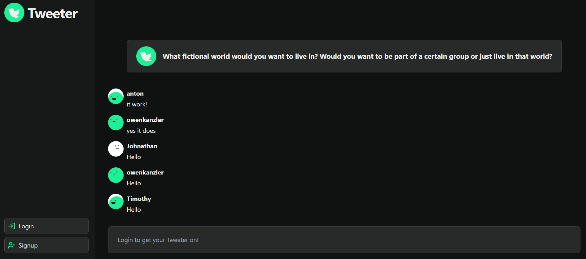

# Tweeter

## Description

The chat room project is a real-time messaging application that allows users to engage in conversations with each other. The chat room features a unique twist where it generates random questions for users to discuss. The motivation behind this project was to create an interactive and engaging platform for users to connect and share their thoughts on various topics.  

By incorporating real-time messaging functionality, users can have seamless conversations with each other, fostering a sense of community and collaboration. The project aims to solve the problem of finding interesting conversation starters and providing a platform for users to engage in meaningful discussions.  

## Installation

To get the development environment up and running, follow these steps:

Clone the repository to your local machine <b>or</b> visit [Tweeter](https://tweeter-4z96.onrender.com/) deployed from Render.  

<b>If cloning:</b>  
    1. Navigate to the project directory.  
    2. Install the necessary dependencies by running the command `npm install`.  
    3. Configure the environment variables required for the project.  
    4. Start the development server using the command `npm start`.

## Usage

To use the chat room application, follow these instructions:

1. Access the deployed application or run it locally.
2. Sign up for an account or log in if you already have one.
3. Read the random generated question displayed and type your answer in the chat.
4. Engage in real-time chat with other users.
5. Enjoy the interactive and dynamic nature of the chat room.

Below is a screenshot of what Tweeter should look like upon reaching the homepage.

## Technologies Used
- <b>Frontend:</b> React, HTML, CSS, JavaScript
- <b>Backend:</b> Node.js, Express.js
- <b>DB:</b> MongoDB
- <b>Real-Time Messaging:</b> Socket.io
- <b>Deployement:</b> Render

## Credits

- Anton Osland - [GitHub Profile](https://github.com/anton-oz)
- Alex LaPierre - [GitHub Profile](https://github.com/aslapi)
- Justin Holderman - [GitHub Profile](https://github.com/justindholderman)
- Owen Kanzler - [GitHub Profile](https://github.com/owenkanzler)
- Jesse Theis - [GitHub Profile](https://github.com/JesseTheis)
